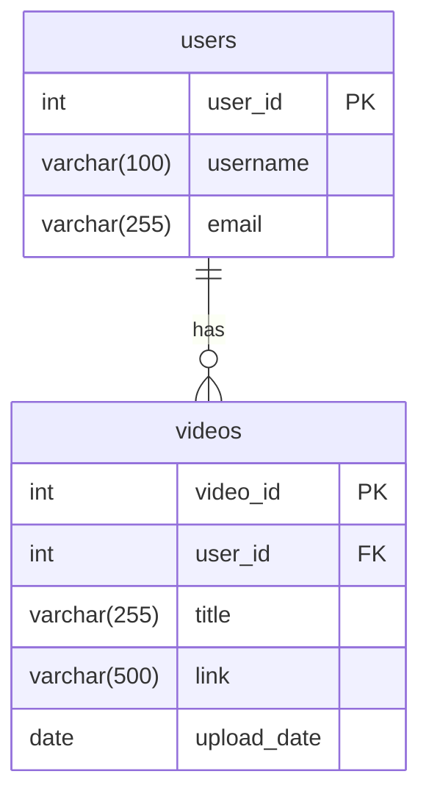

Databases Fundamentals – Part 2
### Creating RDBMS Structures (Relational Database Management Systems)
**CRUD Operations** (Create, Read, Update, Delete)
*Note by Tandap – Date: [around February 2026]*

---

### 1. Database Creation & Selection Commands (MySQL)
```sql
-- Create a new database
CREATE DATABASE mratube;

-- View all databases
SHOW DATABASES;

-- Switch to (use) the new database
USE mratube;

-- See which database is currently selected
SELECT DATABASE();
```

---

### 2. Creating Tables with Primary Keys & Auto-Increment
**`users` table** (stores user information):
```sql
CREATE TABLE users (
    user_id INT PRIMARY KEY AUTO_INCREMENT,
    username VARCHAR(100) NOT NULL,
    email VARCHAR(255) NOT NULL
);
```
**`videos` table** (stores video information, linked to `users`):
```sql
CREATE TABLE videos (
    video_id INT PRIMARY KEY AUTO_INCREMENT,
    user_id INT,
    title VARCHAR(255) NOT NULL,
    link VARCHAR(500),
    upload_date DATE,
    
    -- Define the foreign key relationship
    FOREIGN KEY (user_id) REFERENCES users(user_id)
        ON DELETE CASCADE
);
```

`user_id` in `videos` is a **foreign key** that references the `user_id` (primary key) in the `users` table.
**`ON DELETE CASCADE`** → If a user is deleted from the `users` table, all their videos are automatically deleted from the `videos` table (prevents "orphaned" records).

This is a classic **one-to-many relationship**:
- **One user** → can upload **many videos**
- Each **video** → belongs to **one user**

---

### 3. Viewing Table Structure
```sql
-- Show the structure (columns, types, keys) of a table
DESCRIBE users;
DESCRIBE videos;
```
(or use `SHOW CREATE TABLE videos;` for the full creation script including keys)

---

### Quick Summary of Key Concepts
- **`AUTO_INCREMENT`:** Automatically generates unique IDs (1, 2, 3...) for new rows.
- **`NOT NULL`:** This column must always have a value.
- **`VARCHAR(n)`:** Variable-length text string (up to `n` characters).
- **`INT`:** Whole number.
- **`DATE`:** Stores dates (e.g., '2026-02-16').
- **`FOREIGN KEY ... REFERENCES`:** Enforces the link between tables.
- **`ON DELETE CASCADE`:** Automatic cleanup when a parent record is deleted.

---

### Visual: One-to-Many Relationship (Crow's Foot Notation)
This is the exact relationship you created (`users` → `videos`):


- The side with `||` near the `users` table means **"one"**.
- The side with `o>` near the `videos` table means **"many"** (zero or many).

This example uses a common pattern: **one user → many videos**. This is a solid foundation for a simple video-sharing app like "mratube"!

### Next Steps
- `INSERT` some sample data
- `SELECT` queries with `JOINs`
- `UPDATE` and `DELETE` examples