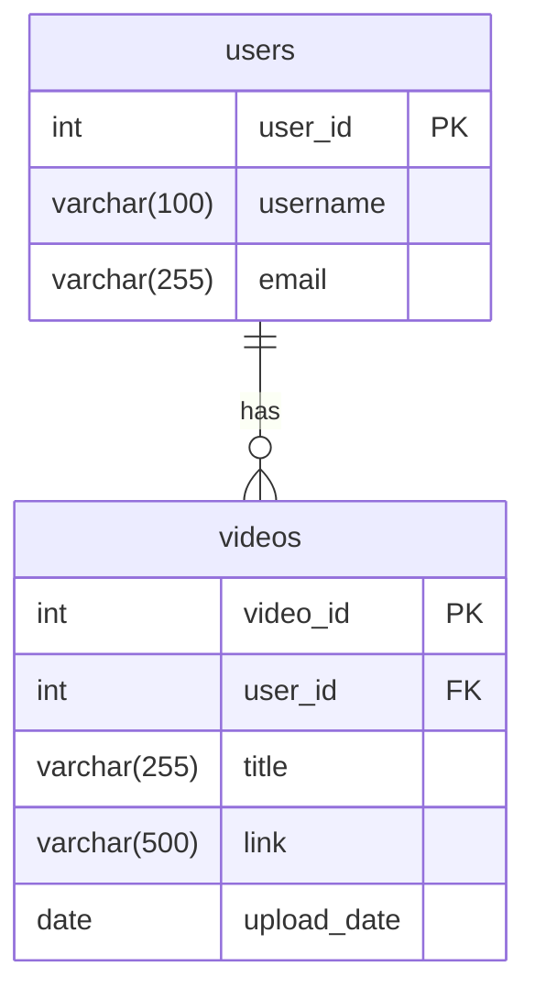

Databases Fundamentals
Note by Tandap – Date: 16/02/2026
A database is a place where we store related data in a structured and organized manner.
Relational Databases
Relational databases organize data using tables, keys, and relationships.
Tables, Keys, and ERDs

Primary Key (PK): A unique identifier for every row (record) in a table. Every table should have one (e.g., id, student_id, order_id).
Foreign Key (FK): A field (or set of fields) in one table that refers to the primary key in another table. It creates a link between the two tables, enforcing referential integrity.
Entity-Relationship Diagrams (ERDs): Visual diagrams that show the relationships between tables (entities). They help design and understand the database structure.

Crow's Foot notation is commonly used to represent relationships visually.
Crow's Foot Notation – Cardinality Symbols
Cardinality describes how many instances of one entity can relate to instances of another (also called relationship types or cardinality).
Here are the standard symbols (from left to right on the relationship line):

One (mandatory / exactly one): 
One and only one (mandatory): ||
Zero or one (optional): o|
Many: >
Zero or many (optional many): o>
One or many (mandatory many): |>
Many (sometimes shown ambiguously without minimum): >

Common combinations in Crow's Foot:

These symbols appear at each end of the relationship line to show how the two tables connect (e.g., one-to-many, many-to-many, one-to-one, optional/mandatory).
CRUD Commands in Action
CRUD stands for the four basic operations on data:

C – Create (insert new records)
R – Read (select/retrieve data)
U – Update (modify existing records)
D – Delete (remove records)

These are performed using SQL (Structured Query Language), the standard language for telling the database what to do.
Examples in SQL:

CREATE → INSERT INTO table ...
READ → SELECT ... FROM table ...
UPDATE → UPDATE table SET ...
DELETE → DELETE FROM table ...