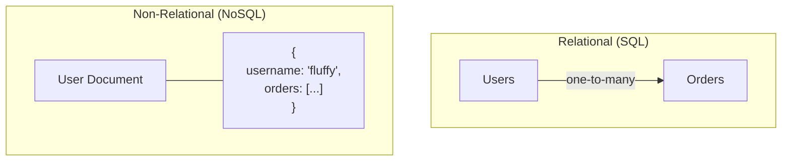

Databases Fundamentals – Part 3
### CRUD Operations in Action + Relational vs Non-Relational
*Note by Tandap – Date: 16/02/2026*

---

### 1. `INSERT` (Create) – Writing Data
Insert into `users` table (`user_id` will auto-increment):
```sql
INSERT INTO users (username, email)
VALUES
    ('fluffy', 'fluffy@gmail.com'),
    ('paws', 'paws@gmail.com');
```

Insert into `videos` table (linking to users):
```sql
INSERT INTO videos (user_id, title, link, upload_date)
VALUES
    (1, 'cat skateboarding', 'www.youtube.com/cat-skate', '2026-02-16'),
    (2, 'fluffy jumps', 'www.youtube.com/fluffy-jump', '2026-02-17'),
    (1, 'another cat video', 'www.youtube.com/cat2', '2026-02-18');
```
**Note:** `user_id` must exist in the `users` table because of the **foreign key constraint**.

---

### 2. `SELECT` (Read) – Viewing Data
```sql
-- View all rows and columns from the videos table
SELECT * FROM videos;

-- Or from the users table
SELECT * FROM users;
```

---

### 3. `UPDATE` – Modifying Data
```sql
UPDATE videos
SET title = 'Fluffy on Skateboard'
WHERE video_id = 1;
```
**Important:** Always use a **`WHERE` clause** with `UPDATE` to avoid changing every row!

---

### 4. `DELETE` – Removing Data
```sql
DELETE FROM videos
WHERE video_id = 3;
```
**Important:** Always use a **`WHERE` clause** with `DELETE` to target specific rows.
Thanks to **`ON DELETE CASCADE`**, deleting a user will also automatically delete their videos.

---

### Quick CRUD Summary
- **Create** → `INSERT INTO ... VALUES ...`
- **Read**   → `SELECT ... FROM ...`
- **Update** → `UPDATE ... SET ... WHERE ...`
- **Delete** → `DELETE FROM ... WHERE ...`

These are the four core operations you use daily in SQL.


---

### 5. Relational vs Non-Relational Databases
#### Relational Databases (SQL)
*(e.g., MySQL, PostgreSQL, SQLite)*
- Data stored in **tables** with rows & columns.
- **Fixed schema** (structure is defined in advance).
- Uses **SQL** for queries.
- Strong relationships via **primary/foreign keys**.
- Great for *structured data* and *transactions* (e.g., banking, e-commerce).

#### Non-Relational Databases (NoSQL)
- **Flexible schema** (no fixed structure).
- Common types:
  - **Document stores** (e.g., MongoDB) → JSON-like documents.
  - **Key-value stores** (e.g., Redis) → simple `key: value` pairs.
  - **Graph databases** (e.g., Neo4j) → nodes & relationships.
- Better for *unstructured data*, *scalability*, and *speed* in certain cases.
- Often **no joins** — data is denormalized or nested.

---

Your `mratube` example is a classic **relational setup**, perfect for learning structured data.

### Next Steps
- `SELECT` with `JOIN` to combine `users` and `videos`.
- Use `WHERE`, `ORDER BY`, and `LIMIT` for filtering/sorting.
- See how `ON DELETE CASCADE` works.