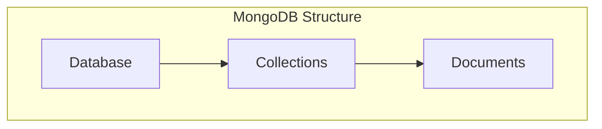

Databases Fundamentals – Part 4
Relational vs Non-Relational Databases + Hands-On with MongoDB (NoSQL)
Note by Tandap – Date: [around February 2026]
Relational vs Non-Relational (NoSQL) Databases – Detailed Comparison
Relational (SQL) Databases (e.g., MySQL, PostgreSQL)

Fixed schema: Strict tables with predefined columns and data types
Predictable and highly organized structure
Built-in rules for accuracy (e.g., primary keys, foreign keys, constraints) prevent duplicates and ensure data integrity
Optimized for complex queries (JOINs across multiple tables)
Strong consistency (ACID properties: Atomicity, Consistency, Isolation, Durability)
Vertical scaling: Grow by upgrading to bigger servers (limited potential)

Non-Relational (NoSQL) Databases

Flexible schema: No fixed structure — can adapt to changing data easily
Various formats: Document stores (JSON-like), wide-column, key-value, graph, time-series, vector databases
Often use eventual consistency: Data becomes consistent over time (not always immediate)
Optimized for fast, simple reads/writes on large datasets
Horizontal scaling: Add more servers easily — near-unlimited growth
Common types:
Document stores (e.g., MongoDB)
Wide-column stores (e.g., Cassandra)
Graph databases (e.g., Neo4j)
Time-series databases
Vector databases (for AI/ML embeddings)


Here's a clear comparison table (from standard sources):
```mermaid
graph TD
    subgraph Relational (SQL) - Tables
        direction TB
        users(Users Table)
        posts(Posts Table)
        users -- "user_id (FK)" --> posts
    end
    subgraph Non-Relational (NoSQL) - Documents
        direction TB
        user_doc(User Document)
        user_doc --> post_subdoc("posts: [...]")
    end
```


Key takeaway: Use relational for structured data with complex relationships/transactions (e.g., banking, e-commerce). Use NoSQL for flexible, high-volume, scalable apps (e.g., social media, IoT, big data).
Hands-On with MongoDB (NoSQL – Document Store)
MongoDB Basics

Data stored in databases → collections (like tables) → documents (JSON-like objects, flexible fields)

Visual of structure:



Connecting to MongoDB Shell (example with admin credentials):
Bashmongosh --authenticationDatabase "admin" -u "myUserAdmin" -p "Admin#123"
Common Commands in Mongo Shell:
JavaScript// Switch to (or create) a database — it creates automatically on first use
use mratube;  // or any name, e.g., migowtube

// Create collections (like tables) — MongoDB creates them on first insert too
db.createCollection("users");
db.createCollection("videos");

// Show all collections in current database
show collections;

// Insert multiple documents (like INSERT INTO ... VALUES)
db.users.insertMany([
    {
        username: "fluffy",
        email: "fluffy@gmail.com"
    },
    {
        username: "paws",
        email: "paws@gmail.com"
    }
]);

// To view inserted data (like SELECT *)
db.users.find().pretty();  // pretty() makes output readable
Notes on your example:

No need for predefined columns — documents can have different fields.
insertMany is efficient for bulk inserts.
MongoDB auto-adds an _id field if not provided (unique identifier).

You're bridging relational and NoSQL perfectly! Next steps could include:

Finding documents with queries (find({username: "fluffy"}))
Updating/deleting in MongoDB
Embedding videos inside user documents (denormalized style)