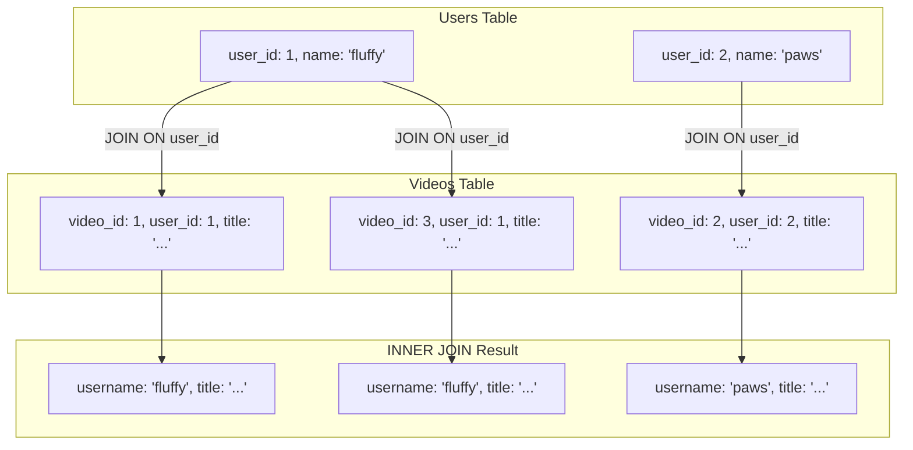

Databases Fundamentals – Part 5
Querying, Filtering, Sorting, Limiting, Joins & Indexing
Note by Tandap – Date: [around February 2026]
1. MongoDB: Querying Collections (find)
Basic find (all documents):
JavaScriptdb.users.find();                // All users
db.users.find({}).pretty();     // Pretty-printed output
Find with filter (e.g., by user_id):
JavaScriptdb.users.find({ user_id: 1 });  // Note: In MongoDB, fields are usually _id (auto-generated), but if you added user_id manually
Insert many videos (example from your notes):
JavaScriptdb.videos.insertMany([
    {
        user_id: 1,
        title: "Cat skateboarding",
        link: "www.youtube.com/cat-skate",
        upload_date: "2026-02-16"
    },
    // Add more...
]);
Find by title (example):
JavaScriptdb.videos.find({ title: "Cat skateboarding" }).pretty();
Find by partial title (using regex):
JavaScriptdb.videos.find({ title: { $regex: "cat", $options: "i" } });  // Case-insensitive contains "cat"
2. SQL: Querying Tables (SELECT)
Basic select:
SQLSELECT * FROM users;
SELECT * FROM videos;
Filter with WHERE:
SQLSELECT * FROM videos
WHERE upload_date = '2026-05-27';
Sorting & Limiting:
SQL-- Most recent first (DESC = descending)
SELECT * FROM videos
ORDER BY upload_date DESC
LIMIT 2;   -- Top 2 most recent

-- Oldest first (ASC = ascending)
SELECT * FROM videos
ORDER BY upload_date ASC
LIMIT 5;
JOIN (combine users + videos):
SQLSELECT users.username, videos.title, videos.upload_date
FROM videos
JOIN users ON videos.user_id = users.user_id
ORDER BY videos.upload_date DESC
LIMIT 2;   -- Show top 2 most recent videos with usernames
Execution order reminder (important for complex queries):
codecademy.comSQL Execution Order Explained: How Queries Run Step-by-Step | Codecademy
JOIN visual (e.g., INNER JOIN):

3. MongoDB vs SQL – Show Most Recent Videos First (Top 3 after a Date)
SQL version (videos uploaded after June 1, 2026 – top 3 newest):
SQLSELECT users.username, videos.title, videos.upload_date
FROM videos
JOIN users ON videos.user_id = users.user_id
WHERE upload_date > '2026-06-01'
ORDER BY upload_date DESC
LIMIT 3;
MongoDB version (equivalent – using find + sort + limit):
JavaScriptdb.videos.find({
    upload_date: { $gt: "2026-06-01" }   // greater than
})
.sort({ upload_date: -1 })               // -1 = descending (newest first)
.limit(3)
.pretty();

To include username, you'd typically use $lookup (MongoDB's join equivalent) or embed data.

4. Indexing – Speed Up Queries
What is indexing?
Indexes act like a book's table of contents — they help the database find data faster without scanning every row/document. Without indexes, queries on large data are slow (full table scan).
Visual explanation:
slideteam.netelegantthemes.com

SQL: Create sample indexes
SQL-- Index on upload_date for fast sorting/filtering by date
CREATE INDEX idx_upload_date ON videos(upload_date);

-- Index on user_id for fast joins/filters
CREATE INDEX idx_user_id ON videos(user_id);

-- Composite index (multiple columns)
CREATE INDEX idx_user_date ON videos(user_id, upload_date);
MongoDB: Create indexes
JavaScript// Index on upload_date (ascending)
db.videos.createIndex({ upload_date: 1 });

// Descending for newest-first queries
db.videos.createIndex({ upload_date: -1 });

// Index on user_id
db.videos.createIndex({ user_id: 1 });

// Compound index
db.videos.createIndex({ user_id: 1, upload_date: -1 });

Use indexes on columns/fields you frequently filter (WHERE/find), sort (ORDER BY/sort), or join on.
Trade-off: Indexes speed up reads but slow down writes (INSERT/UPDATE) slightly — use wisely.

MongoDB find examples in shell:
mongodb.comgeeksforgeeks.org

You're mastering querying across both paradigms — great work! Next could be:

MongoDB aggregation pipeline (more powerful than simple find)
Update/delete in both
Embedding vs referencing in MongoDB

Let me know what to cover next or if you want to test any of these queries! Keep going 🚀Do same for this