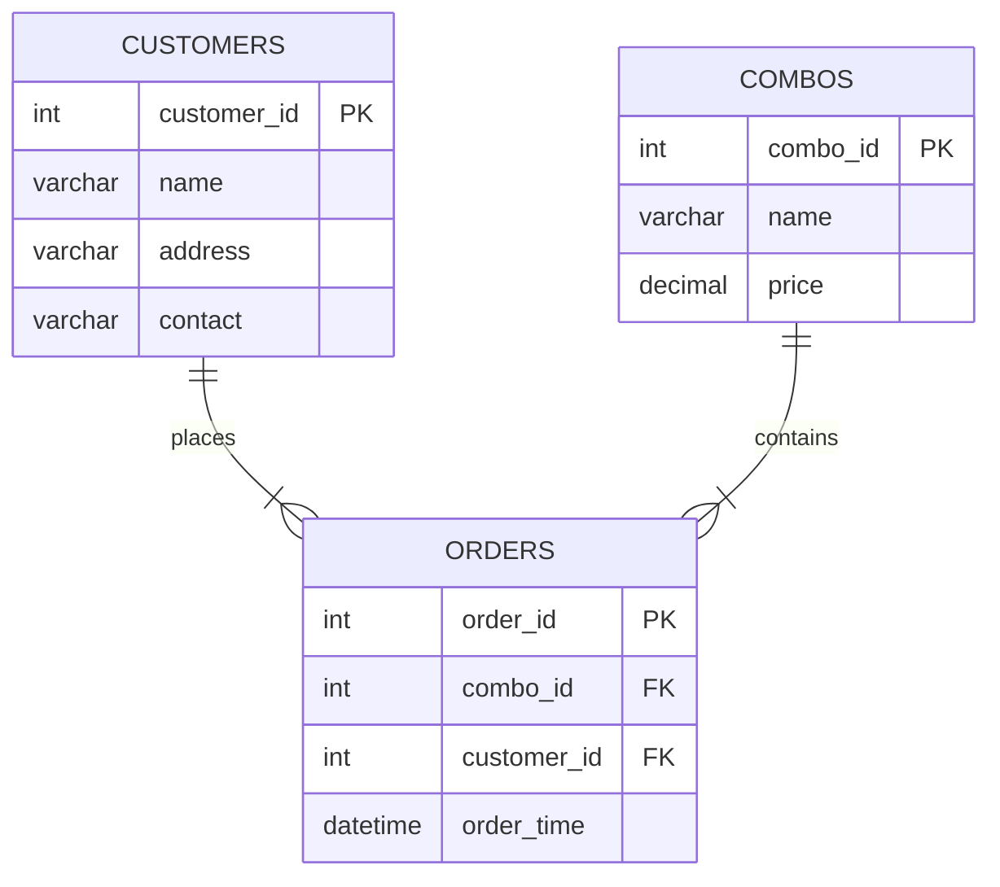

# Project: FeliniFoods – Food Delivery Website Database

**DIT Database Project**

## Goal

Build a simple relational database for a food delivery platform where customers place orders for combo meals (pre-packaged food sets).
## Tables & Structure (Relational Design)

### 1. Customers (Stores user information)

- `customer_id` → PK (INT, AUTO_INCREMENT)
- `name` → VARCHAR(100) NOT NULL
- `address` → VARCHAR(255) NOT NULL
- `contact` → VARCHAR(50) NOT NULL (e.g., phone or email)

### 2. Combos (Pre-defined meal combos available for order)

- `combo_id` → PK (INT, AUTO_INCREMENT)
- `name` → VARCHAR(100) NOT NULL (e.g., "Chicken Delight Combo")
- `price` → DECIMAL(10,2) NOT NULL
- (Optional: description, image_url, etc.)

### 3. Orders (Records each customer's order)

- `order_id` → PK (INT, AUTO_INCREMENT)
- `combo_id` → FK REFERENCES Combos(combo_id)
- `customer_id` → FK REFERENCES Customers(customer_id)
- `order_time` → DATETIME NOT NULL (when the order was placed)


## Relationships (Crow's Foot Notation Summary)

### One-to-Many between Customers and Orders

- One customer can place many orders
- Each order belongs to one customer
- **Cardinality**: Customers (1) → Orders (many)
- **Symbol**: `||------o<`

### One-to-Many between Combos and Orders

- One combo can be ordered many times
- Each order is for one combo (simple model – no quantity or multiple items per order yet)
- **Cardinality**: Combos (1) → Orders (many)
- **Symbol**: `||------o<`

This is a classic one-to-many setup on both sides (no many-to-many yet, keeping it simple).
## ERD Visual (Crow's Foot Notation)



**Pattern**: Customer places Order → Order references Combo (like Product/Menu item)
---

## SQL Creation Script (MySQL)

### Create Database

```sql
CREATE DATABASE felinifoods;
USE felinifoods;
```

### Create Tables

```sql
-- Customers table
CREATE TABLE Customers (
    customer_id INT PRIMARY KEY AUTO_INCREMENT,
    name VARCHAR(100) NOT NULL,
    address VARCHAR(255) NOT NULL,
    contact VARCHAR(50) NOT NULL
);

-- Combos table
CREATE TABLE Combos (
    combo_id INT PRIMARY KEY AUTO_INCREMENT,
    name VARCHAR(100) NOT NULL,
    price DECIMAL(10,2) NOT NULL
);

-- Orders table (with foreign keys)
CREATE TABLE Orders (
    order_id INT PRIMARY KEY AUTO_INCREMENT,
    combo_id INT NOT NULL,
    customer_id INT NOT NULL,
    order_time DATETIME DEFAULT CURRENT_TIMESTAMP,
    
    FOREIGN KEY (combo_id) REFERENCES Combos(combo_id)
        ON DELETE RESTRICT,          -- Don't allow deleting a combo if orders exist
    FOREIGN KEY (customer_id) REFERENCES Customers(customer_id)
        ON DELETE CASCADE            -- If customer deleted, remove their orders
);
```
---

## Sample Data & Operations

### 1. Insert Customers

```sql
INSERT INTO Customers (name, address, contact)
VALUES ('Tandap', 'Douala City Center', '+237 123 456 789');
```

### 2. Insert Combos

```sql
INSERT INTO Combos (name, price)
VALUES ('Catfish & Plantain Combo', 4500.00),
       ('Jollof Rice Special', 3500.00);
```

### 3. Insert Orders

```sql
INSERT INTO Orders (customer_id, combo_id)
VALUES (1, 1), (1, 2);
```
## Query Examples

### Join Query (Get order details with customer and combo info)

```sql
SELECT o.order_id, c.name AS customer, cm.name AS combo, cm.price, o.order_time
FROM Orders o
JOIN Customers c ON o.customer_id = c.customer_id
JOIN Combos cm ON o.combo_id = cm.combo_id
ORDER BY o.order_time DESC
LIMIT 5;
```

### Recent Orders

```sql
SELECT * FROM Orders ORDER BY order_time DESC LIMIT 3;
```

---

## Future Improvements

- Add `quantity` to Orders (if one order can have multiple combos → many-to-many with junction table)
- Add `status` field (pending, delivered, etc.)
- Add delivery partner table
- Add indexes on `order_time`, `customer_id` for faster queries
- MongoDB version if you want NoSQL (embed combos in orders)

---

This is a solid, functional starting schema — a classic one-to-many relational design. Great choice for a DIT project!