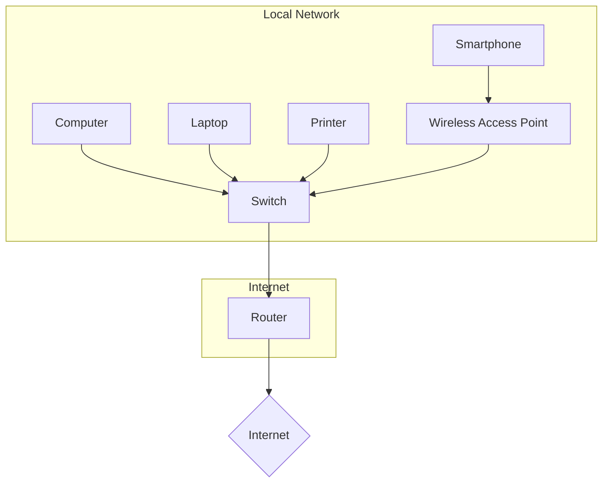

# Pieces and Parts of a Network

A network is composed of various hardware and software components that work together to enable communication and resource sharing.

## Network Diagram

## Hardware Components

*   **End Devices:** Devices that are connected to the network and are used by end-users, such as computers, laptops, smartphones, printers, and servers.
*   **Network Interface Card (NIC):** A hardware component that connects a device to the network. It has a unique MAC address.
*   **Cables and Connectors:** Physical media used to connect devices on a wired network. Common types include Ethernet cables (Cat5e, Cat6) and fiber optic cables.
*   **Switches:** Devices that connect multiple devices on a local network. They use MAC addresses to forward data to the correct destination.
*   **Routers:** Devices that connect different networks together. They use IP addresses to route traffic between networks.
*   **Access Points (APs):** Devices that allow wireless devices to connect to a wired network.
*   **Modems:** Devices that modulate and demodulate signals to allow communication over telephone lines, cable, or satellite.

## Software Components

*   **Network Operating System (NOS):** Software that runs on servers and provides network services, such as file and print sharing, user management, and security.
*   **Protocols:** A set of rules that govern how data is transmitted and received over a network. Examples include TCP/IP, HTTP, and FTP.
*   **Applications:** Software that users interact with to access network resources, such as web browsers, email clients, and file sharing applications.