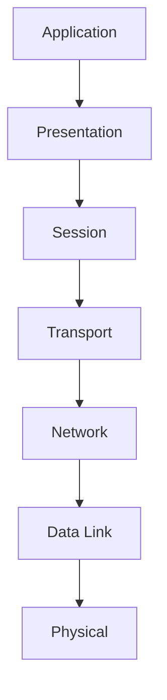

# The OSI Model

The Open Systems Interconnection (OSI) model is a conceptual framework that standardizes the functions of a telecommunication or computing system into seven abstraction layers. Each layer serves a specific function and communicates with the layers directly above and below it.

## The Seven Layers of the OSI Model

1.  **Physical Layer:** Responsible for the physical connection between devices. It defines the hardware, cables, connectors, and signaling.
    *   **Devices:** Hubs, Repeaters, Cables, Connectors.
    *   **Protocols:** Ethernet, USB, Bluetooth.

2.  **Data Link Layer:** Responsible for error-free data transfer between nodes on the same local network. It manages MAC addresses and provides error detection and correction.
    *   **Devices:** Switches, Bridges, Network Interface Cards (NICs).
    *   **Protocols:** Ethernet, Wi-Fi, ARP.

3.  **Network Layer:** Responsible for routing data between different networks. It uses IP addresses to determine the best path for data to travel.
    *   **Devices:** Routers, Layer 3 Switches.
    *   **Protocols:** IP (Internet Protocol), ICMP (Internet Control Message Protocol), OSPF (Open Shortest Path First).

4.  **Transport Layer:** Responsible for end-to-end communication and data integrity. It provides services such as segmentation, reassembly, and error checking. The two main protocols at this layer are TCP (Transmission Control Protocol) and UDP (User Datagram Protocol).
    *   **Devices:** Firewalls, Load Balancers.
    *   **Protocols:** TCP (Transmission Control Protocol), UDP (User Datagram Protocol).

5.  **Session Layer:** Responsible for establishing, managing, and terminating sessions between applications.
    *   **Protocols:** NetBIOS, PPTP (Point-to-Point Tunneling Protocol).

6.  **Presentation Layer:** Responsible for data translation, encryption, and compression. It ensures that data is in a usable format for the application layer.
    *   **Protocols:** SSL (Secure Sockets Layer), TLS (Transport Layer Security), JPEG, MPEG.

7.  **Application Layer:** The layer closest to the end-user. It provides network services to applications, such as web browsers, email clients, and file transfer programs.
    *   **Protocols:** HTTP (Hypertext Transfer Protocol), FTP (File Transfer Protocol), SMTP (Simple Mail Transfer Protocol), DNS (Domain Name System).

The OSI model provides a common language and framework for network professionals to understand and troubleshoot network problems.