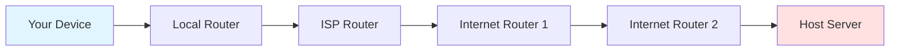
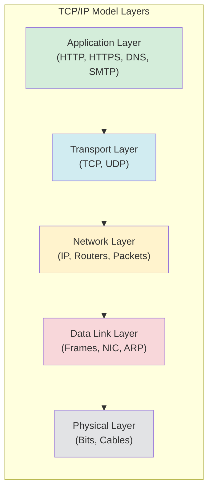
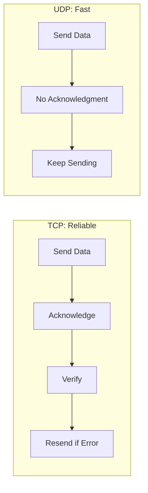
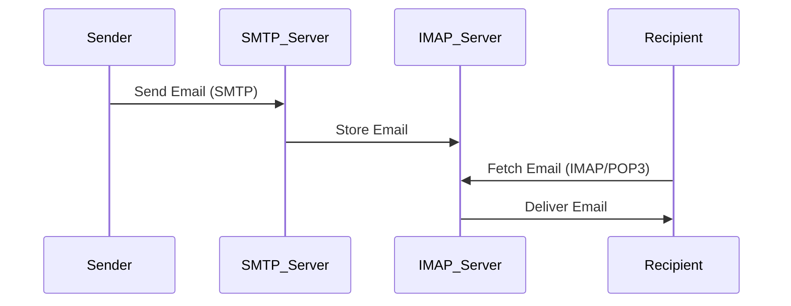

# The Internet & Networking Protocols

**Date**: [blank]

## How Data Travels on the Internet

### Data Packets

Data is divided into **packets**, each containing:
- **Header**: Source and destination information
- **Payload**: The actual data
- **Checksum**: Error detection

### DNS (Domain Name System)
- Translates website names (e.g., `google.com`) into IP addresses
- Acts as the "phonebook" of the internet

### IP Addresses (Internet Protocol)
- **Source IP** → **Destination IP**
- Logical address for routing data across networks

### MAC Addresses
- Physical hardware address assigned to a device
- Used at the Data Link layer

### Data Path Flow

**Process**:
1. Device → Router → ISP → Chain of routers
2. Each router checks destination IP address
3. Picks the best next hop using **routing table**
4. Reaches host server containing requested content

### Routing Table
- Contains path references and best routes
- Determines optimal path for packet delivery

---

## Network Hardware

### Bridge
- Connects two network segments (can be switches or LANs)
- Operates at Data Link layer (Layer 2)
- Filters traffic based on MAC addresses
- Reduces network collisions by dividing collision domains

### Protocols
- Rules that determine how data is sent and received
- Ensure devices can communicate effectively

---

## TCP/IP Model

The TCP/IP model ensures reliable delivery of data across networks.

### The Five Layers

### Layer Details

| Layer | Data Unit | Key Components | Function |
|-------|-----------|----------------|----------|
| **Application** | Data | HTTP/HTTPS, DNS, SMTP | User-facing protocols |
| **Transport** | Segments/Datagrams | TCP, UDP | Reliable/fast delivery |
| **Network** | Packets | IP, Routers | Addressing & routing |
| **Data Link** | Frames | NIC, ARP, MAC | Local network delivery |
| **Physical** | Bits | Cables, signals | Physical transmission |

---

## Transport Layer Protocols

### TCP (Transmission Control Protocol)
- **Ensures reliable delivery**
- Connection-oriented
- Error checking and retransmission
- Used for: web browsing, email, file transfer

### UDP (User Datagram Protocol)
- **Prefers speed over reliability**
- Connectionless
- No error checking or retransmission
- Used for: streaming, gaming, VoIP

### TCP vs UDP Comparison

---

## Application Layer Protocols

### Email Protocols

- **SMTP** (Simple Mail Transfer Protocol)
  - Used for **sending** email
  - Port 25 (or 587 for secure)
  
- **SMTPS** (SMTP Secure)
  - Encrypted version of SMTP
  
- **IMAP** (Internet Message Access Protocol)
  - Used to **fetch** emails from server
  - Keeps emails on server
  - Port 143 (or 993 for secure)
  
- **POP3** (Post Office Protocol v3)
  - Downloads emails to local device
  - Port 110 (or 995 for secure)

### Email Flow Diagram

