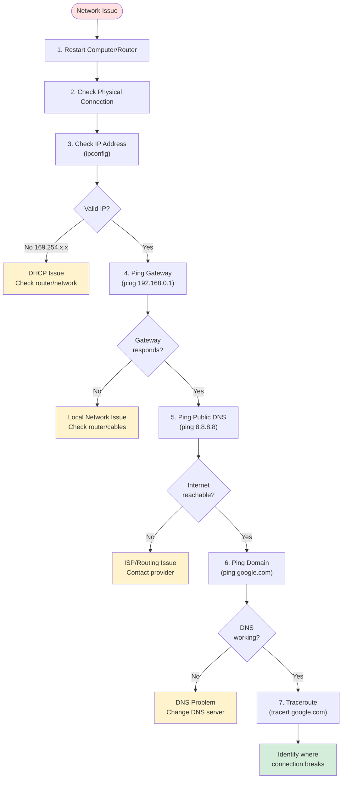

# Applied Networking

**Date**: [blank]

## File Transfer Protocols

### FTP (File Transfer Protocol)
- Used for transferring files between computers
- Port 21
- **Not encrypted** (credentials sent in plain text)

### SFTP (SSH File Transfer Protocol)
- Secure/encrypted version of file transfer
- Uses SSH (Secure Shell) for encryption
- Port 22
- Recommended for secure file transfers

**Note**: SFTP is different from FTPS (FTP Secure), which uses SSL/TLS encryption

---

## Network Troubleshooting

### Troubleshooting Flowchart



### Step-by-Step Troubleshooting Guide

#### 1. Start Simple
- **Restart computer**
- **Power cycle**: Unplug/replug computer and router
- **Check cables**: Unplug and replug network cable
- **Restart router** if applicable

#### 2. Check IP Configuration

**Windows Command**:
```bash
ipconfig
```

**What to look for**:
- Find **IPv4 Address** under your network adapter
- **Valid IP**: Should be in your network range (e.g., `192.168.x.x`, `10.x.x.x`)
- **Invalid IP**: `169.254.x.x` means no DHCP/no valid IP assigned

#### 3. Test Local Network (Ping Gateway)

```bash
ping 192.168.0.1
```
*or sometimes `192.168.1.1` (common default router IPs)*

**Purpose**: Verify local network connectivity to your router

#### 4. Test Internet Connectivity

```bash
ping 8.8.8.8
```

**Purpose**: Check if you can reach Google's public DNS server
- Tests actual internet routing beyond local network
- If this fails → likely no internet connection or routing issue

#### 5. Test DNS Resolution

```bash
ping google.com
```

**Diagnosis**:
- ✅ If `8.8.8.8` works but `google.com` fails → **DNS problem**
- ❌ If both fail → **No internet connection/routing issue**

#### 6. Trace Route Path

**Windows**:
```bash
tracert google.com
```

**Linux/macOS**:
```bash
traceroute google.com
```

**Purpose**: 
- Shows the path/hops packets take to reach destination
- Identifies where connection breaks or has high latency
- Each line shows a router along the path

---

## Important Network Commands

| Command | Platform | Purpose |
|---------|----------|----------|
| `ipconfig` | Windows | Shows IP configuration, gateway, DNS servers |
| `ifconfig` | Linux/macOS | Shows network interface configuration |
| `ping <target>` | All | Basic reachability test (local, public IP, domain) |
| `tracert <target>` | Windows | Shows path/hops to destination |
| `traceroute <target>` | Linux/macOS | Shows path/hops to destination |
| `nslookup <domain>` | All | Query DNS records |
| `ipconfig /flushdns` | Windows | Clear DNS cache |

---

## Quick Troubleshooting Checklist

- [ ] **Step 1**: Restart computer/router
- [ ] **Step 2**: Check physical connection (cable/Wi-Fi)
- [ ] **Step 3**: `ipconfig` → Verify valid IP address
- [ ] **Step 4**: `ping 192.168.0.1` (or your gateway) → Local network OK?
- [ ] **Step 5**: `ping 8.8.8.8` → Internet routing OK?
- [ ] **Step 6**: `ping google.com` → DNS working?
- [ ] **Step 7**: `tracert google.com` → See where it fails

---

## Common Issues & Solutions

### Issue: 169.254.x.x IP Address
**Cause**: No DHCP server response  
**Solution**: 
- Check router is powered on
- Verify DHCP is enabled on router
- Try `ipconfig /release` then `ipconfig /renew` (Windows)

### Issue: Can ping 8.8.8.8 but not google.com
**Cause**: DNS resolution failure  
**Solution**: 
- Change DNS server to `8.8.8.8` (Google DNS)
- Flush DNS cache: `ipconfig /flushdns`

### Issue: Can't ping gateway
**Cause**: Local network problem  
**Solution**: 
- Check physical cable connection
- Verify Wi-Fi is connected
- Restart router
- Check firewall settings