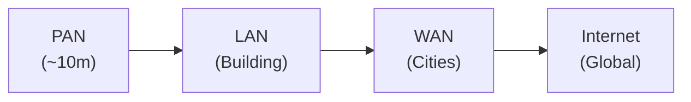
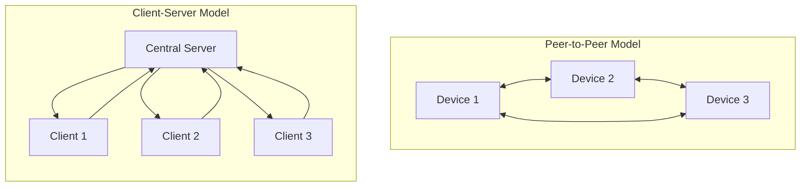

# Networking Fundamentals

**Date**: 13/10/2026 | **Instructor**: Alan

## What is a Network?

A network is a group of connected devices that can share resources or access the internet.

## Types of Networks

### PAN (Personal Area Network)
- Designed for close proximity (e.g., smartphones, Bluetooth)
- Range: ~10 meters
- User devices in immediate personal space

### LAN (Local Area Network)
- Devices connected within a single specific location (e.g., a building)
- Can be wired or wireless
- Examples: home, school, or small office networks

### WLAN (Wireless LAN)
- Wireless version of LAN
- Uses Wi-Fi technology

### WAN (Wide Area Network)
- Connects multiple cities or locations
- Managed by an ISP (Internet Service Provider)
- Connects networks across large distances

### Internet
- Global system connecting millions of networks
- Enables access to email, file transfer, web services, etc.

### Network Scale Comparison

---

## Network Models

### Peer-to-Peer (P2P)
- Devices connect directly (no central server needed)
- Perfect for file sharing
- Decentralized architecture

### Client-Server
- Uses a central server
- Multiple clients connect to access/share resources
- Examples: Netflix, Zoom, file servers
- Works well in both LANs and WANs

### Network Models Comparison

